--------------
Jan 28 2020
--------------
Training deviance of single-feature GLM: Run MATLAB program `glm_single_feat_train.m` and `plot_glm_single_feat.m`.
It's weird that the deviance explained is high for 'WT Light Search', 'WT Dark Chase' etc. Maybe there are too many '0' events in the training datasets for those groups.

 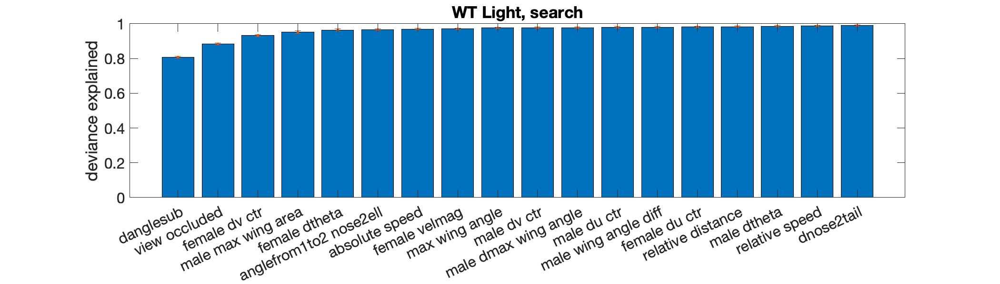
 
 
 
 
 

--------------
Jan 19 2020
--------------
Bout triggered average. Check all the features prior to the initiation of 'chase' and 'search' behaviors. Run MATLAB program `plot_BTA.m`, dependent on `bout_triggered_average.m` and `plot_areaerrorbar.m`.

Maybe the filters from GLM are similar to the BTAs here? 

'chase', WT Light (blue) v.s. WT Dark (orange)

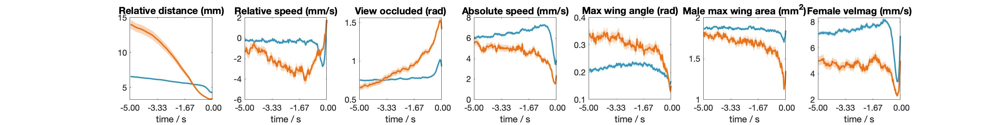

non-'chase', WT Light (blue) v.s. WT Dark (orange)

'search', WT Light (blue) v.s. WT Dark (orange)

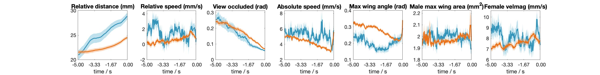
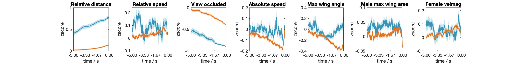
non-'search', WT Light (blue) v.s. WT Dark (orange)

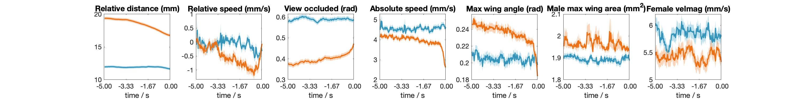
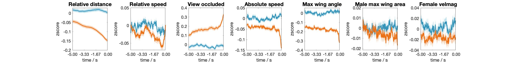
'chase', WT Dark (blue) v.s. Or47b Dark (orange)

non-'chase', WT Dark (blue) v.s. Or47b Dark (orange)

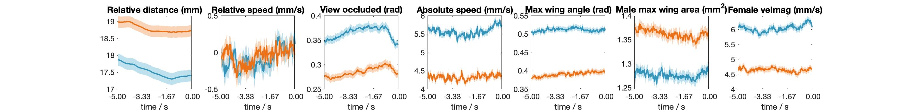

'search', WT Dark (blue) v.s. Or47b Dark (orange)

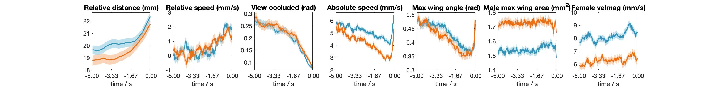

non-'search', WT Dark (blue) v.s. Or47b Dark (orange)

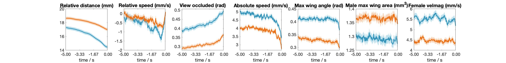

'chase', WT Light (blue) v.s. Or47b Light (orange)

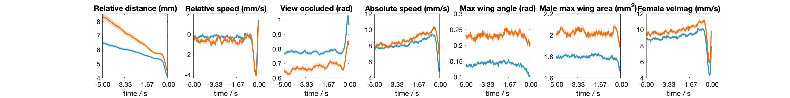

non-'chase', WT Light (blue) v.s. Or47b Light (orange)

'search', WT Light (blue) v.s. Or47b Light (orange)

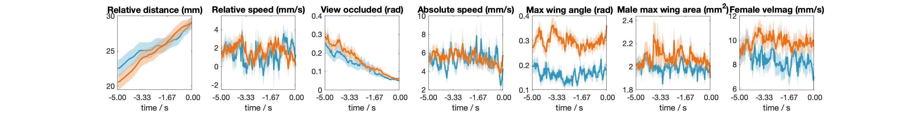

non-'search', WT Light (blue) v.s. Or47b Light (orange)

--------------
Jan 13 2020
--------------
Trying GLM on binary output, i.e. search or not, chase or not. 

About behavior bout, how to select them? First, look at the time length distribution of these two behaviors. Run MATLAB program `plot_behav_length_stat.m`, dependent on `behav_length_stat.m` and `plot_areaerrorbar.m`.

Shown in the following figure, the second group (WT/Or47b Light) data seems weird. The behaviors are like bread crumbs instead of bread slices. What was going on in these flies' head?

Back to the bout selection, if the 'chase' lasts longer than 0.5s (I determine it arbitrarily, based on the distribution), then count it as a 'chase' bout. Next step: bout triggered average for the 'chase' bouts.

--------------
Jan 07 2020
--------------

1. Behavior selection, do we need all the chase/search behavior?

2. Feature selection, primarily focus 'mfDist', add more features if necessary, for example if the 'mfDist' is noisy being an olfactory proxy, consider further description of female movement as the odor source 

3. GLM first, simple things first.

4. Use lab machine, not mine. Establish the remote access.

--------------
Jan 06 2020
--------------
After many lessons from previous experience, I decided to take detailed record of coding/analysis during a project. Let's see if this will make a difference!
